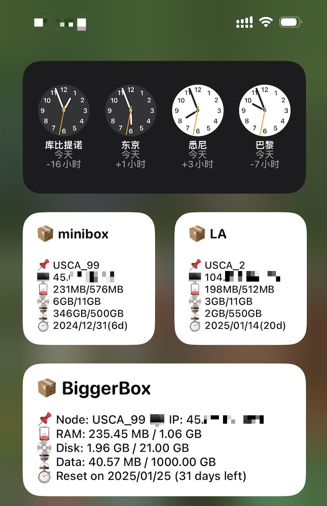
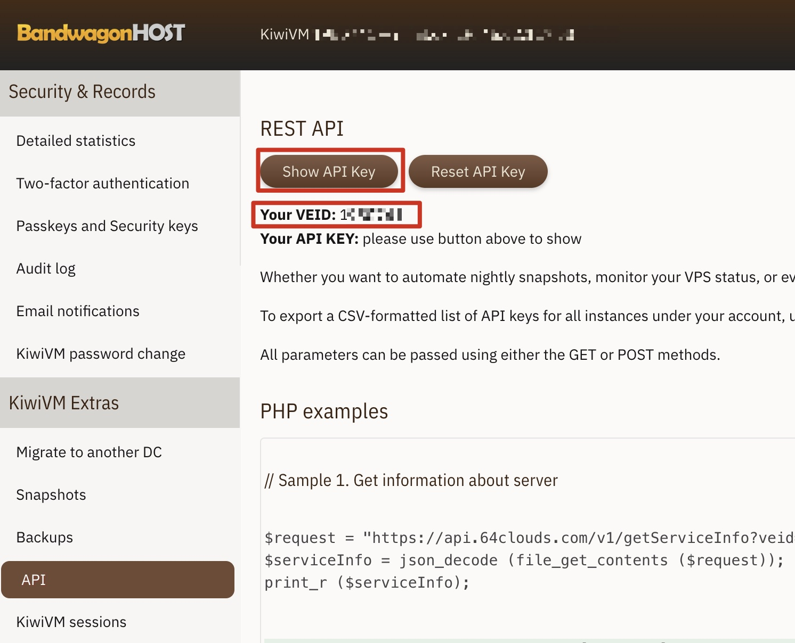
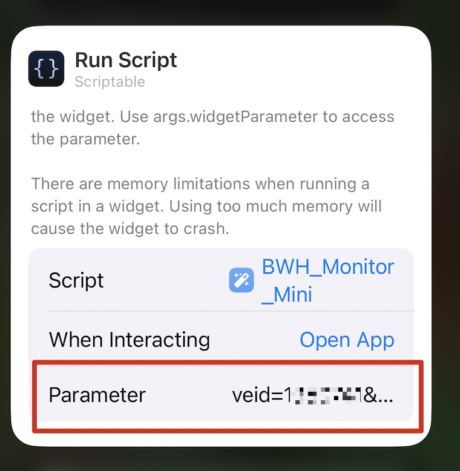

[English](#English)

# 中文

使用 [Scriptable](https://scriptable.app) 基于 [BandWagonHost](https://bandwagonhost.com/aff.php?aff=19348)(aff) API实现的服务器监控小组件。

因此首先你需要去AppStore安装 [Scriptable](https://scriptable.app)

## 效果预览



## 使用说明

### 脚本说明

项目包含 `bwh_monitor.js` 和 `bwh_monitor_mini.js`，建议对应使用中型小组件、小型小组件

小型组件因空间问题，省略了字段描述，只保留了ICON。所有ICON对应关系如下：

```
📌 Node info
🖥 IP address
🪫 RAM usage
💿 Disk space
⏳ Data used
⏱️ Data reset time
```

### 获取APIKEY

进入Kiwi控制面板里的API模块，获取 veid、apikey



### 添加组件、配置参数

添加组件时，利用 `Parameter` 进行传参



共有三个参数

- veid:kiwi中获取的veid
- apikey:kiwi中获取的apikey
- title:`[可选项]`小组件的标题，如果不指定，则默认使用hostname作为标题


传参方式如下：

```
# 必传
veid=1xxxxx&apikey=private_xxxxxxxxxxxxxxxxxx

OR

# title参数可选项
veid=1xxxxx&apikey=private_xxxxxxxxxxxxxxxxxx&title=I_AM_Title

```

## 感谢 & 参考

灵感来源与代码copy，感谢 [@412999826](https://github.com/412999826) 开源

https://community.nssurge.com/d/3131-vps

https://github.com/412999826/surge-panel/blob/main/VPS-info.js


## ☕ 来杯咖啡

如果你喜欢这个小组件，欢迎使用我的aff链接购买BandWagonHost服务器，谢谢

[BandWagonHost](https://bandwagonhost.com/aff.php?aff=19348)

[BandWagonHost备用](https://bwh81.net/aff.php?aff=19348)


# English

Using [Scriptable](https://scriptable.app) to create a vps monitoring widget based on the [BandWagonHost](https://bandwagonhost.com/aff.php?aff=19348)(aff) API.

Therefore, you first need to install [Scriptable](https://scriptable.app) from the App Store.

## Preview


## User Guide

### Description

The project includes `bwh_monitor.js` and `bwh_monitor_mini.js`, and it is recommended to use medium widgets and small widgets accordingly.

The small widget omits field descriptions due to space constraints and retains only the icons. The correspondence for all icons is as follows:

```
📌 Node info
🖥 IP address
🪫 RAM usage
💿 Disk space
⏳ Data used
⏱️ Data reset time
```

### Get API Key

Access the API module in the Kiwi control panel to obtain veid and apikey.


### Add component and configure parameters.

When adding a component, use `Parameter` to pass arguments.


There are three parameters:

- veid: The veid obtained from Kiwi.
- apikey: The apikey obtained from Kiwi.
- title: [Optional] The title of the widget. If not specified, the hostname will be used as the default title.


The parameters can be passed as follows:

```
# Required parameters
veid=1xxxxx&apikey=private_xxxxxxxxxxxxxxxxxx

OR

# The title parameter is optional
veid=1xxxxx&apikey=private_xxxxxxxxxxxxxxxxxx&title=I_AM_Title

```

## Thank you & References

Inspiration and code copied from, thanks to [@412999826](https://github.com/412999826) for open-sourcing.

https://community.nssurge.com/d/3131-vps

https://github.com/412999826/surge-panel/blob/main/VPS-info.js


## ☕ Buy Me A Coffee

If you like this widget, feel free to use my affiliate link to purchase BandWagonHost servers. Thank you!

[BandWagonHost](https://bandwagonhost.com/aff.php?aff=19348)

[BandWagonHost Mirror](https://bwh81.net/aff.php?aff=19348)
